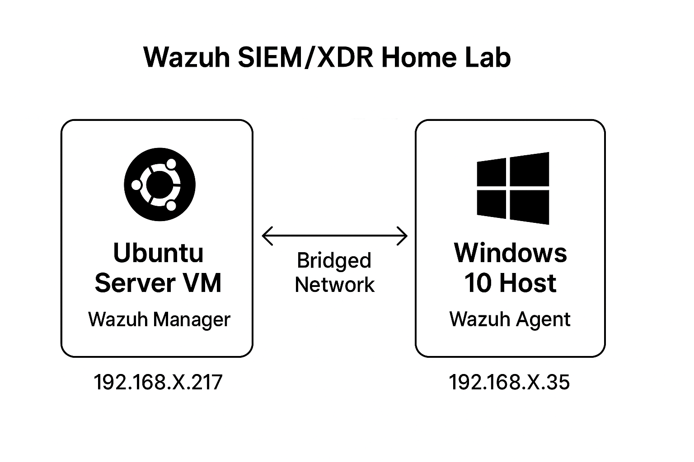

# Wazuh SIEM/XDR Home Lab – SOC Analyst Defensive Project

## Overview
This project documents my **hands-on practice** setting up a defensive cybersecurity home lab using **Wazuh** (SIEM + XDR).  
The lab simulates a SOC (Security Operations Center) environment where logs and events from a **Windows endpoint** are monitored, analyzed, and visualized in a **Wazuh Manager** running on **Ubuntu**.

**Skills Practiced:**
- SIEM & XDR deployment
- Network configuration (bridged adapter)
- Agent–Manager integration
- File Integrity Monitoring (FIM)
- Log analysis and event verification

---

## Lab Architecture

**Components:**
- **Ubuntu Server VM** → Wazuh Manager
- **Windows 10 VM** → Wazuh Agent
- **Network** → Bridged Adapter (same subnet for communication)

Windows Host (Agent) <----> Ubuntu VM (Manager)

---




---

## ⚙ Setup Steps

### 1️⃣ Lab Requirements
- Laptop with at least **8 GB RAM**
- **VirtualBox** (free hypervisor)
- Ubuntu Server VM for Wazuh Manager
- Windows 10 Host for Wazuh Agent
- Bridged network configuration

---

### 2️⃣ Install Wazuh Manager (Ubuntu)
```bash
# Switch to the root user
sudo su

# Install Java dependency
apt install default-jdk -y

# Download the Wazuh installation assistant
curl -sO https://packages.wazuh.com/4.12/wazuh-install.sh

# Run the all-in-one installer
bash wazuh-install.sh -a

#After installation is complete there is username and password Save the Login Password for login

```
---
### 3️⃣ Access the Wazuh Dashboard
Follow these steps to log in to your new Wazuh environment.

1. Find Your Server's IP Address

You will need the IP address of your Ubuntu server to access it from a web browser. Run one of the following commands in the server's terminal. The modern command is ip a.

```Bash
# Modern command (recommended)
ip a
```
or the older ifconfig command (you may need to install it first with apt install net-tools).
```Bash
# Older command
ifconfig
```
Look for the inet address listed under your primary network interface (e.g., eth0 or ens33). It will look something like 192.168.1.100.

2. Open in Browser: On a separate computer on the same network, open a web browser and go to https://YOUR_UBUNTU_IP_ADDRESS.

3. Accept Security Warning: Your browser will show a security warning because the installer uses a self-signed certificate. Click "Advanced" and "Proceed" to continue.

4. Log In: Use the credentials from the installation output to log in.
Username: admin

  Password: <The randomly generated password you saved from Step 2>

---
### 4️⃣ Installingthe Wazuh Agent (Windows Host)
1. Download the latest Wazuh agent MSI installer from the official documentation:

Wazuh Agent for Windows
2. Install the MSI package on your Windows system using the default settings.

---
### 5️⃣ Registeringthe Agent with the Manager

5.1 Generate Agent Key on Ubuntu Manager

Run the agent management utility:
```
sudo /var/ossec/bin/manage_agents
```
● Select A to add an agent.

● Assign a name (e.g., WindowsHost).

● Leave IP address blank unless static assignment is needed.

● After creation, select E to extract the key.

● Copy the key output.

5.2 Apply Key in the Windows Agent

1. Open Wazuh Agent Manager GUI from the Start Menu.
2. Paste the copied key into the appropriate field.
3. Save and apply the key.
4. Add the manager's IP address (IP address of your Ubuntu manager).
5. Restart the agent service.

You can then go to the WAZUH dashboard and see the agent onboarded.

---
### 6️⃣ File Integrity Monitoring (FIM) on Windows

Wazuh supports real-time monitoring of file and folder changes using Syscheck.

6.1 Edit Agent Configuration

Open the following configuration file in Notepad as Addministrator:
```
C:\Program Files (x86)\ossec-agent\ossec.conf
```
Add the following entry inside the Directory block:
```
<directories realtime="yes">Your_Desired_Directory's_path</directories>
```
This monitors the specified folder in real-time.

6.2 Restart the Agent

After saving the changes, restart the Wazuh agent service to apply the configuration.

---
### 7️⃣ Verifying the Setup

1. Open the Wazuh Dashboard in your browser.

2. Navigate to Agents → ensure the Windows agent is listed and status is Active.

3. Go to the Integrity Monitoring section.

4. Perform actions (create/modify/delete files) in the monitored folder.

5. Confirm that alerts appear in the dashboard.

---
### 📸 Proof of Work
Step	Screenshot

Wazuh Dashboard Login	

Windows Agent Added	

Directory Monitoring Config	

File Created Log	

File Deleted Log	

### 📊 Learning Outcomes

Successfully deployed and configured enterprise-grade SIEM

Integrated endpoint log forwarding & correlation

Performed File Integrity Monitoring

Practiced SOC-style monitoring in a home lab setup

### ⚠ Disclaimer
This project is for educational purposes only.

No offensive testing or unauthorized scanning was performed.
